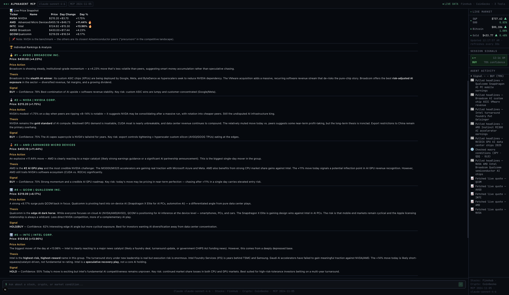

# AlphaAgent MCP

AI-powered financial intelligence terminal built with Claude, the Vercel AI SDK, and Model Context Protocol (MCP).

Ask about any stock, crypto asset, or macro condition. The agent fetches live data across multiple sources, reasons through multiple steps, and delivers a structured signal with confidence score — all streamed in real time.



---

## What it demonstrates

| Capability | Implementation |
|---|---|
| **Claude tool-calling + streaming** | `streamText` with `maxSteps: 8`, streamed via `toDataStreamResponse` |
| **MCP server (HTTP)** | JSON-RPC 2024-11-05 over `/api/mcp` — compatible with any MCP client |
| **MCP server (stdio)** | Standalone server in `mcp-server/` — connects directly to Claude Desktop |
| **Vercel AI SDK v4** | `useChat`, `tool()`, Zod schemas, streaming hooks |
| **Multi-step agent reasoning** | Agent chains quote → news → macro → synthesis in one turn |
| **Live market data** | SPY, BTC, GLD polled every 30 s from the sidebar |
| **Signal extraction** | Regex parses Claude's structured markdown output into typed buy/sell badges |

---

## Architecture

```
Browser (Next.js App Router)
  └── ChatInterface.tsx        useChat → streams from /api/chat
        └── SignalPanel.tsx    live market strip + session signals + agent activity

API Routes
  ├── /api/chat               streamText · Claude claude-sonnet-4-6 · 3 tools · maxSteps 8
  ├── /api/mcp                MCP HTTP server (JSON-RPC 2024-11-05)
  └── /api/ticker             SPY + BTC + GLD for live market strip

MCP Tools (shared between HTTP + stdio servers)
  ├── get_quote               Finnhub (stocks) · CoinGecko (crypto)
  ├── get_news                Finnhub company news + general fallback
  └── get_market_context      SPY · QQQ · GLD macro snapshot + fear/greed estimate

Standalone MCP Server
  └── mcp-server/index.ts     StdioServerTransport · run with `npm run mcp`
```

---

## Getting started

### 1. Clone and install

```bash
git clone https://github.com/mykldggn/AlphaAgent-MCP.git
cd AlphaAgent-MCP
npm install
```

### 2. Set environment variables

Create `.env.local`:

```
ANTHROPIC_API_KEY=sk-ant-...
FINNHUB_API_KEY=your_key_here
```

- **Anthropic API key** — [console.anthropic.com](https://console.anthropic.com)
- **Finnhub API key** — [finnhub.io](https://finnhub.io) (free tier: 60 req/min)
- CoinGecko is used for crypto pricing and requires no key

### 3. Run the dev server

```bash
npm run dev
# → http://localhost:3000
```

### 4. (Optional) Connect to Claude Desktop via stdio MCP

```bash
npm run mcp
```

Add to your Claude Desktop config (`~/Library/Application Support/Claude/claude_desktop_config.json`):

```json
{
  "mcpServers": {
    "alpha-agent": {
      "command": "node",
      "args": ["/path/to/AlphaAgent-MCP/mcp-server/dist/index.js"]
    }
  }
}
```

---

## MCP HTTP server

Send MCP JSON-RPC requests to `POST /api/mcp`.

**List tools:**
```bash
curl -X POST http://localhost:3000/api/mcp \
  -H "Content-Type: application/json" \
  -d '{"jsonrpc":"2.0","id":1,"method":"tools/list","params":{}}'
```

**Call a tool:**
```bash
curl -X POST http://localhost:3000/api/mcp \
  -H "Content-Type: application/json" \
  -d '{"jsonrpc":"2.0","id":2,"method":"tools/call","params":{"name":"get_quote","arguments":{"ticker":"NVDA"}}}'
```

---

## Stack

- **Framework** — Next.js 15 (App Router)
- **AI** — Anthropic Claude claude-sonnet-4-6 via `@ai-sdk/anthropic`
- **AI SDK** — Vercel AI SDK v4 (`ai`, `ai/react`)
- **MCP** — `@modelcontextprotocol/sdk` 2024-11-05
- **Data** — Finnhub REST API, CoinGecko API
- **Styling** — Tailwind CSS
- **Language** — TypeScript
